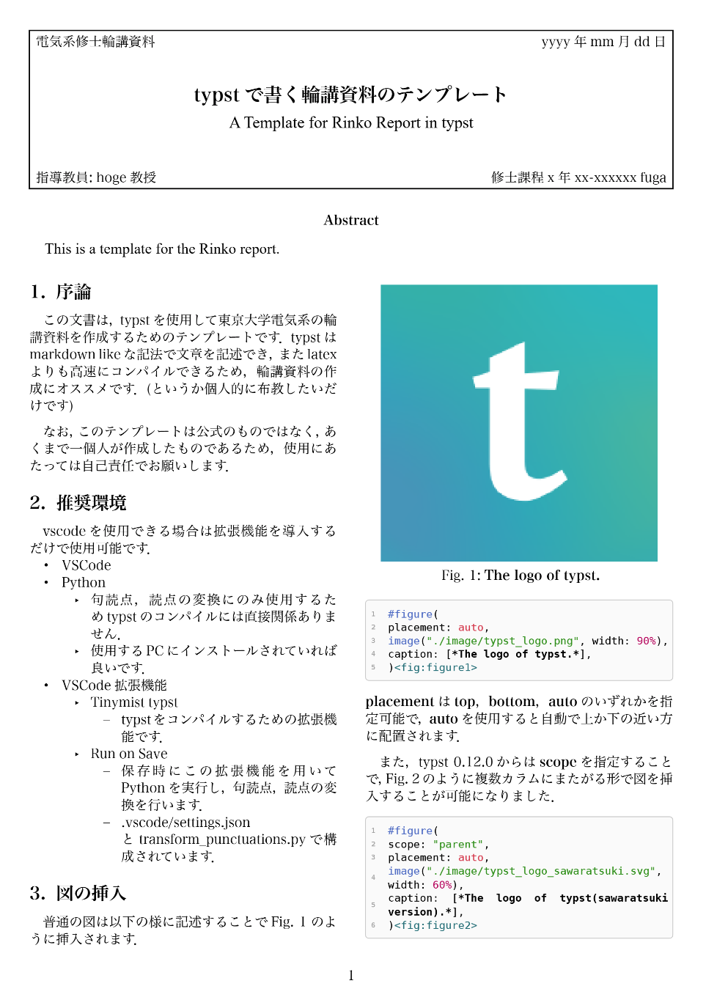
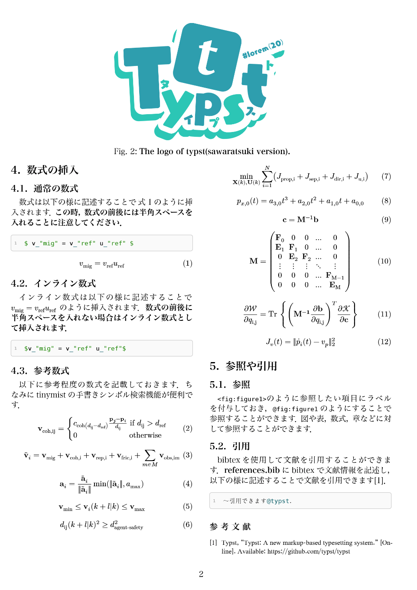
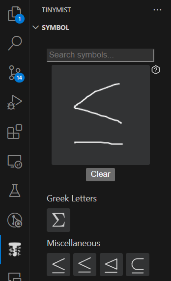

# typstによる輪講資料のテンプレート
typstを使用して東京大学電気系の輪講資料を作成するためのテンプレートです。
なお、このテンプレートは公式のものではなく、あくまで一個人が作成したものであるため使用にあたっては自己責任でお願いします。

2カラムのレイアウトですが、カラムをまたがる図を挿入することも可能です。案外、この形式のtypstのテンプレートは少ないようなので、参考にしていただければ幸いです。

  
  

## 推奨環境
vscodeを使用できる場合は拡張機能を導入するだけで使用可能です。
- VSCode
- Python
  - 句読点、読点の変換にのみ使用するためtypstのコンパイルには直接関係ありません
  - 使用するPCにインストールされていれば良いです
- VSCode拡張機能
  - Tinymist typst
    - typstをコンパイルするための拡張機能です
  - Run on Save
    - 保存時にこの拡張機能を用いてPythonを実行し，句読点，読点の変換を行います
    - .vscode/settings.jsonとtransform_punctuations.pyで構成されています

## 使い方
[YYMMDD_EE-x_x_name.pdf](YYMMDD_EE-x_x_name.pdf)に使い方を記載しています。[YYMMDD_EE-x_x_name.typ](YYMMDD_EE-x_x_name.typ)も参考にしてください。

## 変更履歴
- 2025/04/05
  - typst v0.13.0に対応

## Tips
Tinymistの手書きシンボル検索機能が何気に便利です。

